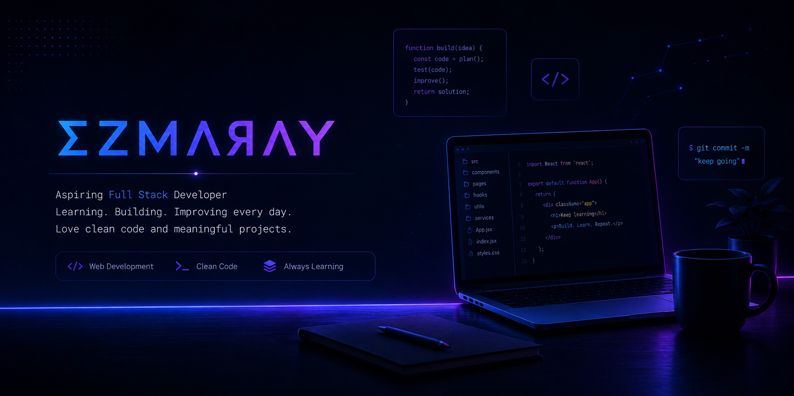

<h1>👋 Hi, I'm Ezmaray Rahimi</h1>

<h3>
💻 Full Stack Web Developer | Building Modern Web Applications
</h3>

---

## 🚀 About Me

I'm a developer who enjoys building modern applications and improving my skills through real-world projects.

- 💻 Focused on Web Development
- 🛠 Building full-stack applications
- 🌱 Exploring modern JavaScript technologies
- 🧠 Interested in clean code, APIs, databases and software architecture
- 🚀 Learning by creating practical projects

---

## 🧰 Tech Stack

---

## 🌟 Featured Project

## 🛒 MERN E-Commerce Platform

A full-stack e-commerce application built with modern web technologies.

### Features

✅ User Authentication  
✅ JWT Authorization  
✅ Product Management  
✅ Shopping Cart  
✅ Order System  
✅ Reviews System  
✅ Image Upload  
✅ Admin Features  
✅ REST API

### Technologies

React • Node.js • Express • MongoDB • Tailwind CSS

---

## 📊 GitHub Stats

---

## 📈 Contribution Activity

---

## 📚 Currently Learning

- Advanced JavaScript
- React Ecosystem
- Next.js
- Backend Architecture
- Database Design

---

## 🌐 Connect With Me

---

⭐ Thanks for visiting my profile ⭐

<h1 align="center">Hi 👋, I'm Ezmaray Rahimi</h1>
## 🚀 About Me

I'm a Computer Science student interested in web development and building practical projects to improve my skills.

- 💻 Interested in Web Development
- 🛠 Building full-stack web applications
- 🌱 Learning and improving my JavaScript skills
- 🔧 Working with REST APIs and databases
- 🧠 Interested in clean and maintainable code
- 🚀 Learning through hands-on projects

---

## 🧰 Tech Stack

### Frontend
HTML • CSS • JavaScript • React • Tailwind CSS

### Backend
Node.js • Express • PHP

### Database
MongoDB • MySQL • SQL

### Tools
Git • GitHub • VS Code • Postman

---

## 🌟 Featured Project

## 🛒 MERN E-Commerce Project

A full-stack e-commerce project built to practice and improve my skills in frontend and backend development.

The project includes user authentication, product management, shopping cart functionality, image uploads, and an admin panel.

### Features

**Authentication**
- User registration and login
- JWT authentication
- Protected routes
- User profile

**Products**
- Product listing
- Product details
- Product search
- Category filtering

**Shopping Cart**
- Add and manage products in the cart

**Admin Panel**
- Create products
- Edit products
- Delete products
- Manage product listings

**Image Upload**
- Multiple images per product
- Image storage and management
- Display uploaded images in the application

**Security**
- Protected user and admin routes
- JWT-based authorization
- Authentication and admin middleware

**Development**
- Feature-based Git workflow
- Feature branches
- Regular commits and merges

### Technologies

React • Tailwind CSS • Node.js • Express • MongoDB • Mongoose

### Project Status

🚧 **In Development**

The core authentication, product management, shopping cart, admin functionality, and image upload features are currently implemented.

Next steps include improving the UI, adding pagination and reusable components, implementing the order system, and preparing the project for deployment.

---

## 📊 GitHub Stats

---

## 📈 Contribution Activity

---

## 📚 Currently Learning

- JavaScript
- React
- Node.js & Express
- MongoDB
- REST API Development
- Database Design
- Next.js

---

## 🌐 Connect With Me

---

⭐ Thanks for visiting my profile ⭐
